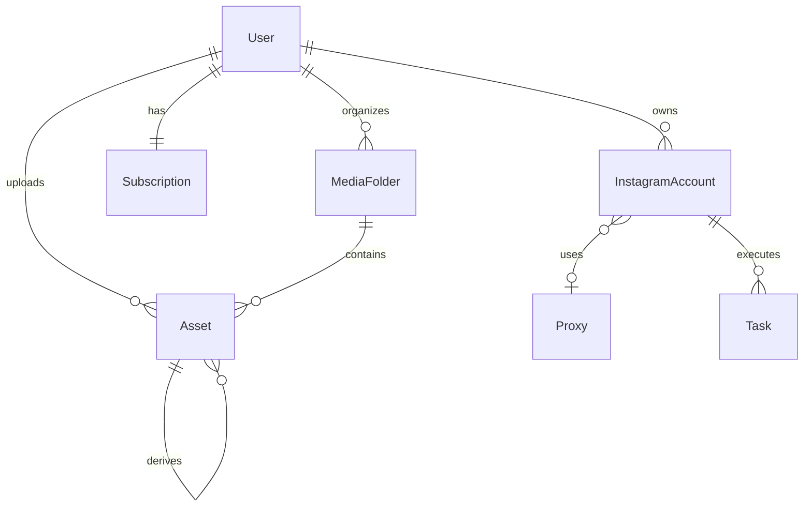

# Architecture Overview

Condensed map of the system. For the full deep-dive, see `ARCHITECTURE.md` in the repo root.

---

## Tech Stack

| Layer | Technology | Why |
|-------|-----------|-----|
| API | **FastAPI** 0.136+ | Async-ready, auto-generated OpenAPI docs, Pydantic v2 validation |
| ORM | **SQLAlchemy** 2.0 | Mapped columns, type-safe queries, `selectin` lazy loading |
| Database | **PostgreSQL** 15+ | JSONB for tags/cookies, `FOR UPDATE NOWAIT` locking |
| Task queue | **Celery** 5.6 | Distributed workers, retry with backoff, soft/hard time limits |
| Broker | **Redis** 7 | Fast, reliable, used for both Celery broker and result backend |
| Browser | **DrissionPage** 4.1 | Chromium automation without Selenium overhead |
| AI | **OpenAI** GPT-4o-mini | Structured Outputs for natural-language → task plan parsing |
| Media | **FFmpeg** | Video re-encoding with noise injection for fingerprint uniqueization |

---

## Data Flow

```
User (frontend)
  │
  ▼
FastAPI  ──────► PostgreSQL
  │                 │
  │  POST /fan-out  │  Task rows
  ▼                 │
Celery worker ◄─────┘
  │
  ▼
DrissionPage (Chromium)
  │
  ▼
Instagram (via proxy)
```

1. **Frontend** sends a natural-language prompt to the AI parser.
2. **AI parser** returns a structured plan with commands.
3. **Orchestrator** fans out the plan — one Task per target account.
4. **Celery worker** picks up a task, locks the account row, boots a Chromium browser, and executes commands.
5. **DrissionPage** drives the browser through Instagram's web UI via an authenticated proxy.

---

## Key Directories

```
IG_CRM/
├── backend/
│   ├── app/
│   │   ├── api/            # FastAPI routers, dependencies
│   │   ├── core/           # config, database, security, celery
│   │   ├── crud/           # database operations per model
│   │   ├── models/         # SQLAlchemy ORM models
│   │   ├── schemas/        # Pydantic request/response schemas
│   │   └── services/       # trust scoring, AI parsing
│   └── workers/
│       ├── actions/        # upload, warmup, update_profile
│       ├── core/           # behavior engine, browser, executor
│       └── utils/          # proxy builder, UA generator
├── migrations/             # Alembic migrations
├── vaults/                 # this Obsidian knowledge base
└── test_cli.py             # interactive CLI tester
```

---

## Database Models



---

## Deployment

Currently single-host development:

- **FastAPI**: `uvicorn app.api.main:app`
- **Celery**: `celery -A app.core.celery_app worker`
- **PostgreSQL**: Docker container on port 5433
- **Redis**: Docker container on port 6379

Production will add Nginx reverse proxy, multiple Celery worker hosts (4-8 Chromium sessions each), and a proper secrets manager for JWT keys and proxy credentials.
